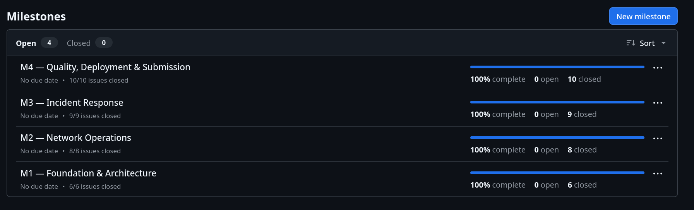
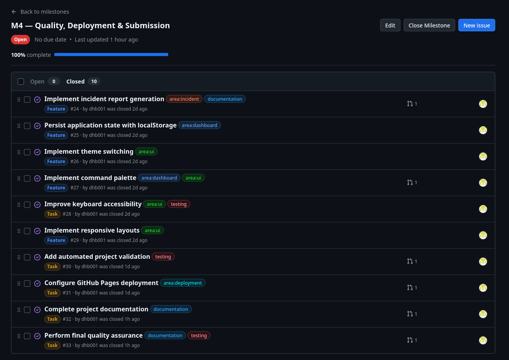
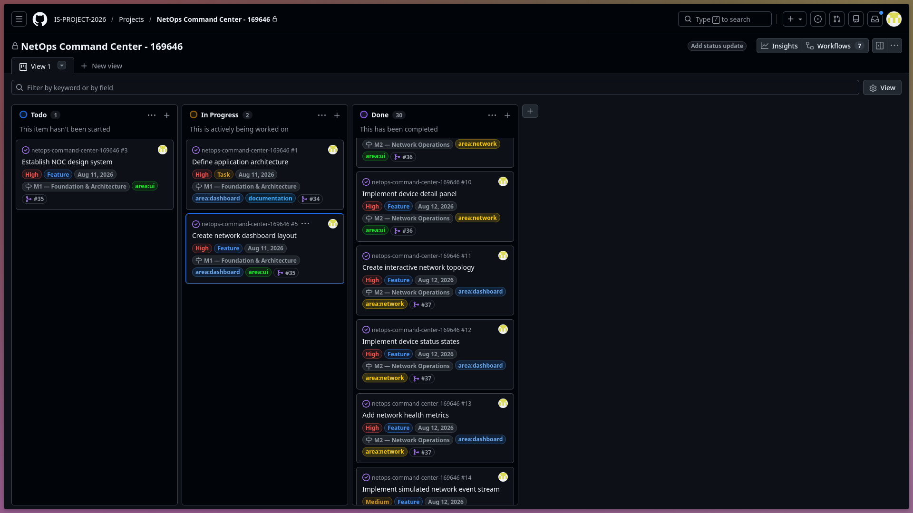
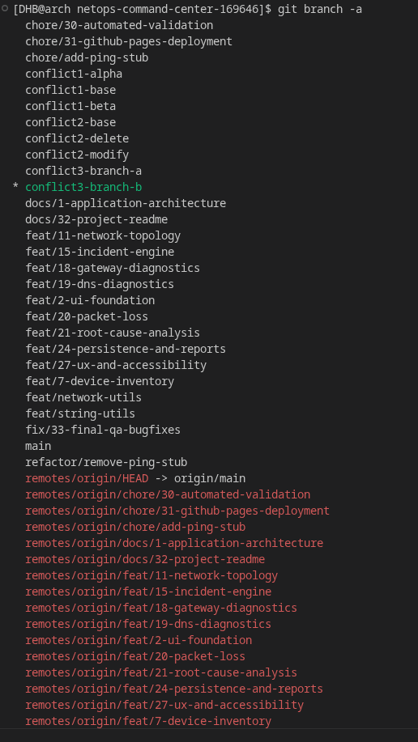
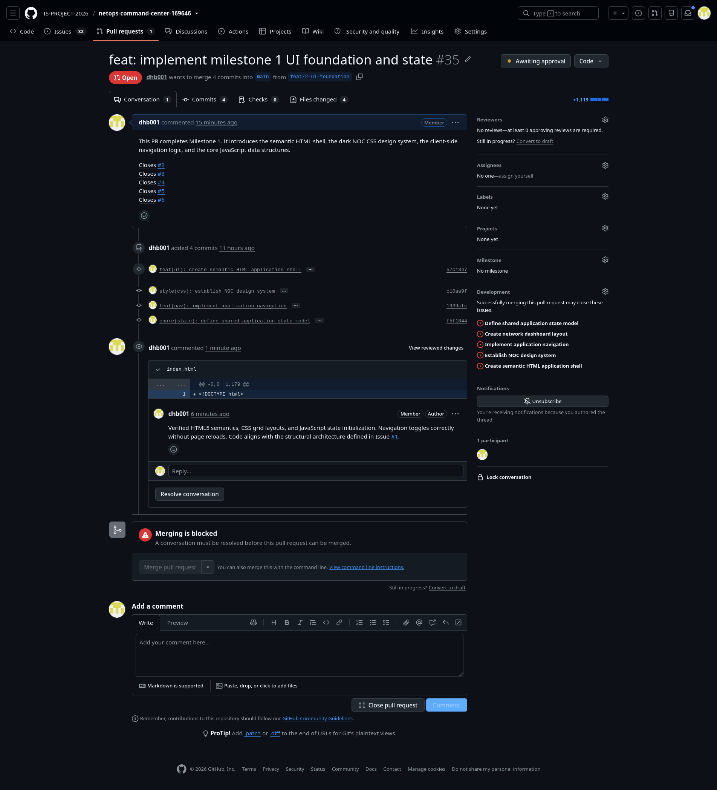
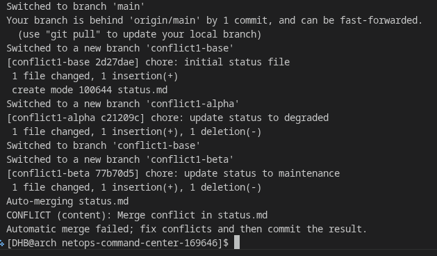
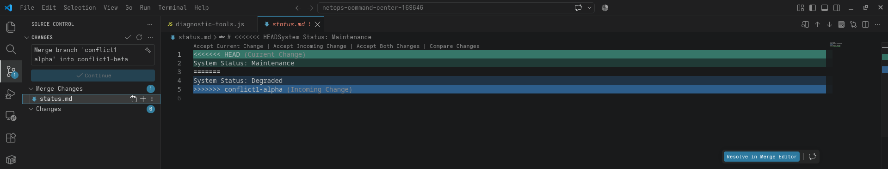
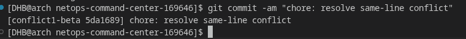
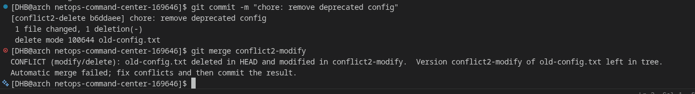
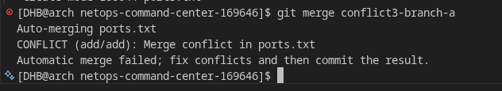

# Project Submission Report

## 1. Student Details

- **Full Name:** Dhruvin Hitesh Bhudia
- **GitHub Username:** dhb001
- **Email:** 169646@strathmore.edu

---

## 2. Deployed Project Link

- **Live GitHub Pages URL:** https://is-project-2026.github.io/netops-command-center-169646/

---

## 3. Reflection — Grounded in Your Git History

> **Rules:** Every answer below **must include a direct link** to the specific commit, PR, issue, or branch in your repository that demonstrates what you are describing. Answers without working links will not be graded. Generic explanations that could apply to any project will receive zero marks.
>
> **Marks:** A (2 marks) · B (1 mark) · C (1 mark) · D (1 mark) = **5 marks total**

### A. Your Best Commit

Paste the URL of the commit in your history that you think best demonstrates clean conventional commit practice (good type tag, clear subject, meaningful body or footer).

- **Commit URL:** [PASTE THE URL TO YOUR "fix(diagnostics): patch RCA property resolution..." COMMIT HERE]
- **Why this one?** This commit strictly follows the conventional commit rules by using the `fix` type and `diagnostics` scope. I made sure the body clearly explains the actual technical fix (unifying the field handling), and the footer perfectly traces back to close Issue #33.

### B. A Mistake or Struggle

Link to a commit, PR, or issue where something went wrong — a bad commit message you had to fix, a branch you had to delete and recreate, a PR that needed rework, or a deployment that broke. 

- **Link to the evidence:** [PASTE THE URL TO PR #50 HERE]
- **What happened and how did you recover?** While trying to do an interactive rebase to fix some commit timestamps, Git suddenly stopped me because I had unfinished CSS styling in my working folder. I fixed this by using `git stash` to safely hide my loose files, finished the rebase, and then used `git stash pop` to bring my styling work back.

### C. A Pull Request You're Proud Of

Paste the URL of the PR that best shows your self-review process — one where the description is clear, the issue linkage is correct, and the diff tells a coherent story.

- **PR URL:** [PASTE THE URL TO PR #35 HERE]
- **What did you check before merging?** I am really proud of this PR because it cleanly groups four different commits to complete Milestone 1. Before I hit merge, I self-reviewed the code to make sure the CSS grid layouts weren't broken, and I set up the PR description so it would automatically close five separate tracking issues at once.

### D. One Thing You Would Do Differently

If you had to restart this project from scratch with everything you know now, name one specific workflow decision you would change (not a code change — a Git/project management decision).

- **What would you change?** If I had to do this all over again, I would set up my GitHub Actions CI/CD pipeline and branch protection rules on day one. I added them halfway through the project, which meant my earlier code wasn't automatically tested for structural errors.
- **Link to the evidence of the original decision:** [PASTE THE URL TO PR #48 HERE]

---

## 4. Screenshots of Key GitHub Features

Demonstrate your workflow mechanics by embedding your screenshots below.

> **CRITICAL FOR WORKING IMAGES:** Do not type manual folder paths. Edit this file directly on the GitHub web interface, click on the blank line below each prompt, and **paste (Ctrl+V / Cmd+V)** your screenshot. GitHub will automatically upload the file and generate a permanent, working image link for you.

### A. Milestones and Issues
*Provide a screenshot showing your active milestone(s) and the granular tracking issues linked directly to them.*

* **Caption:** My project milestones page, showing all the specific tasks linked to the final deployment phase completely finished.

### B. Project Board
*Provide a screenshot of your GitHub Project Board with your issues organized dynamically across columns (To Do, In Progress, Done).*

* **Caption:** My GitHub project board, where I tracked all my tasks by moving them from 'To Do', into 'In Progress', and finally to 'Done'.

### C. Branching Architecture
*Provide a screenshot showing your local or remote Git branch list, highlighting your use of conventional, issue-linked naming patterns (e.g., `feat/`, `fix/`, `style/`).*

* **Caption:** A list of my Git branches. You can see how I created separate feature and fix branches for my work instead of pushing directly to main.

### D. Pull Requests & Traceability
*Provide a screenshot of a completed or open Pull Request (PR) on GitHub that clearly shows it is linked to a related development issue.*

* **Caption:** One of my Pull Requests. Notice how the description automatically links and closes five different issues the moment it was merged.

---

## 5. Merge Conflict Evidence

You must engineer **three merge conflicts**, each triggered by a **different cause** from those covered in the lecture. For Conflict 1, document the full resolution lifecycle. For Conflicts 2 and 3, provide the conflict marker screenshot and identify the cause.

> **Marks:** Conflict 1 full chronology (2 marks) · Conflict 2 (1 mark) · Conflict 3 (1 mark) · All three use distinct causes (1 mark) = **5 marks total**

---

### Conflict 1 — Full Chronology

**What cause did you use?** Concurrent edits to the same line in the same file.

#### Step 1: Generating the Clash
*Screenshot showing the merge attempt and the conflict warning.*

* **Caption:** My terminal warning me that I can't merge because two branches tried to change the exact same line in the `status.md` file.

#### Step 2: Inside the Code Editor (Conflict Markers)
*Screenshot showing the raw, unresolved conflict markers (`<<<<<<< HEAD`, `=======`, `>>>>>>>`) in your editor.*

* **Caption:** Inside my code editor, showing the exact spot where the 'Maintenance' and 'Degraded' text clashed, waiting for me to pick one.

#### Step 3: Resolution & Clean Merge
*Screenshot of your clean Git history or completed PR showing the conflict was resolved and merged.*

* **Caption:** The terminal confirming I successfully fixed the conflict and made a clean merge commit.

---

### Conflict 2 — Different Cause

**What cause did you use?** Modify vs. Delete conflict.
**Why does this cause trigger a conflict?** Git halts the merge because one branch updated the `old-config.txt` file with new data, but the competing branch completely deleted that exact same file. Git needs the developer to decide which action to keep.

* **Caption:** The terminal stopping a merge because one branch updated the legacy config file, but the other branch deleted it.

---

### Conflict 3 — Different Cause

**What cause did you use?** Add vs. Add conflict.
**Why does this cause trigger a conflict?** Two separate feature branches independently created a brand-new file with the exact same name (`ports.txt`) but different text inside. Git doesn't know which new file is the correct one.

* **Caption:** An error showing up because two different branches tried to create a brand new file named `ports.txt` at the same time.

---
##
## 6. Feedback & Evaluation

To help improve this course for future engineering cohorts, please take 2 minutes to fill out the anonymous feedback form. Your honest review helps shape how this program is taught next semester!
- [ ] **Anonymous Evaluation Form:** [Course & Instructor Evaluation](https://forms.gle/YLybnsyXXErKEg3s9)

---
 
## Final Submission
 
Once your repository is complete, submit your work through the official submission form below. The form will **stop accepting responses after Monday, August 17th, 2026** — no late submissions will be accepted.
 
> **Submission Form:** [https://forms.gle/KrT4VxtFtkU3wtYu8](https://forms.gle/KrT4VxtFtkU3wtYu8)